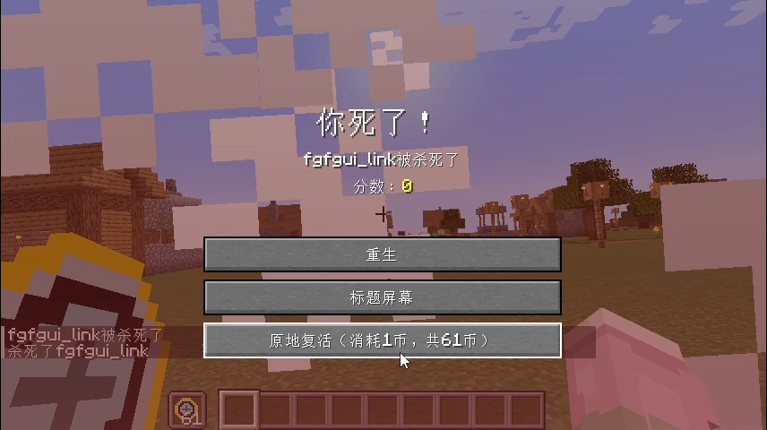
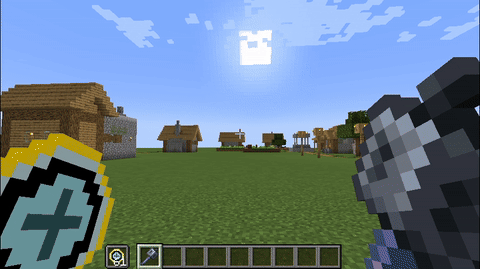
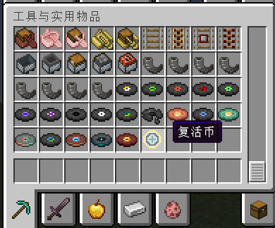
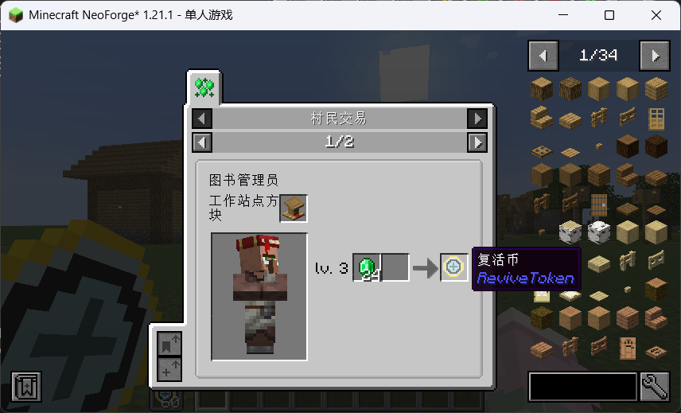
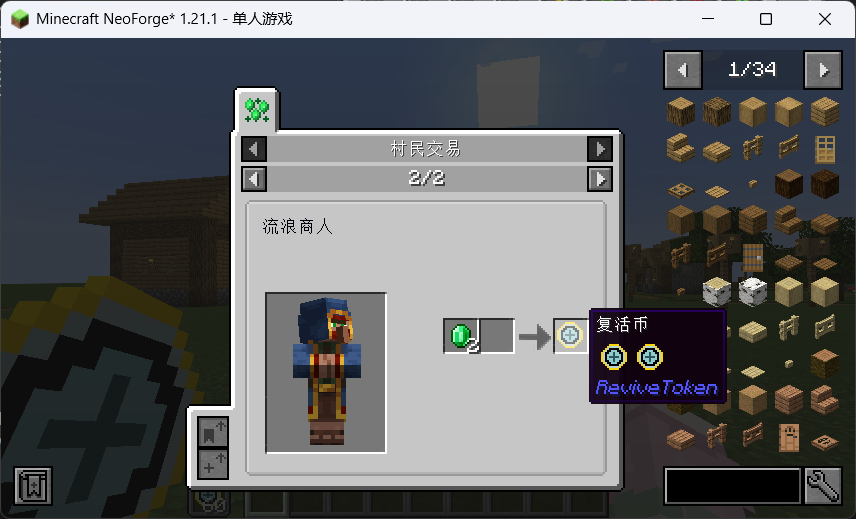
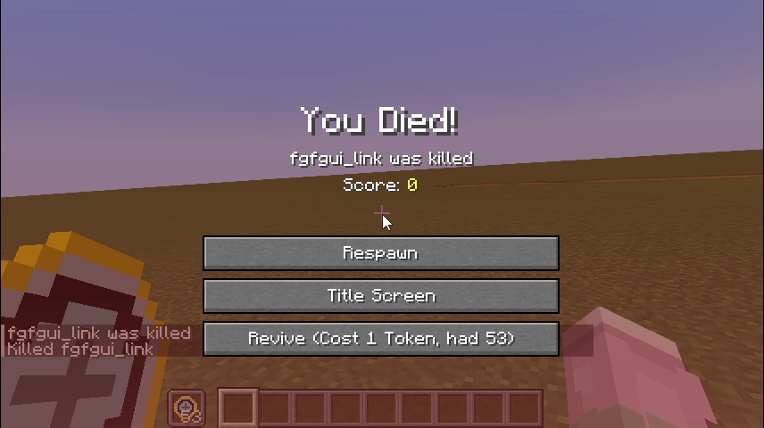
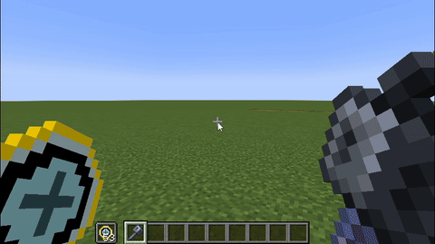
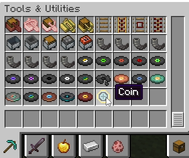
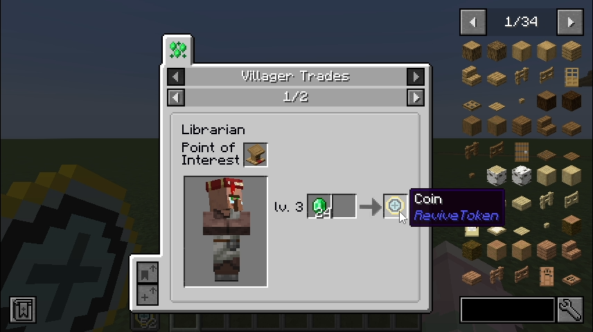
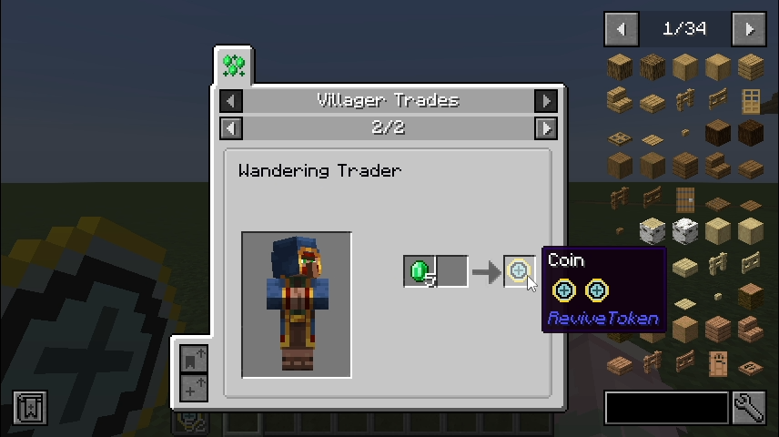

# ReviveToken

[English](#english-version)

复活币
消耗 **1** 个**复活币**可以在当前位置原地复活,复活币不会掉落

gif:


## 新增内容

- 物品:复活币
  
- **交易**:
  1. 图书管理员
     
  2. 流浪商人-一般交易
     
  3. 流浪商人-稀有交易
     
- "原地复活"按钮
  

## 可自定义内容

配置文件示例:

```toml
#Specify the Token item to consume
token = "revivetoken:coin"
#Specify the Item count to consume
# Default: 1
# Range: > 0
cost = 1
#Disable the trade recipes of Coin
notrade = false
```

改变`token`可以改变复活时消耗什么物品(不掉落的物品也会随之改变)
改变`cost`可以改变复活时消耗多少币
将`notrade`改为`true`可以取消添加的交易配方

## FAQ

**Q: 为什么我背包里明明有币但是没有立即复活的按钮?**
**A:** 币不够/币不符合你填的配置文件

**Q: Fabric / Forge / 1.20.1?**
**A:** 不会做,但欢迎 PR

## English Version

Revive Token - Coin   
Consuming **1** Revive Token allows you to respawn on the spot. Tokens will not drop on death.  
  
gif:  


## New Features

- Item: Coin   
  
- **Trades**:
  1. Librarian  
     
  2. Wandering Trader – Common Trade  
     
  3. Wandering Trader – Rare Trade  
     
- "Revive" button  
  

## Customizable Settings

Sample configuration file:

```toml
#Specify the Token item to consume
token = "revivetoken:coin"
#Specify the Item count to consume
# Default: 1
# Range: > 0
cost = 1
#Disable the trade recipes of Coin
notrade = false
```

Changing `token` lets you define which item is consumed upon revival (non-droppable items will also change accordingly).  
Changing `cost` lets you set how many tokens are consumed when reviving.  
Set `notrade` to `true` to disable the added trade recipes.

## FAQ

**Q: Why doesn’t the respawn button appear even though I have tokens in my inventory?**  
**A:** Not enough tokens / tokens don’t match the item defined in the config file.

**Q: Fabric / Forge / 1.20.1 support?**  
**A:** Not implemented. PRs are welcome.
